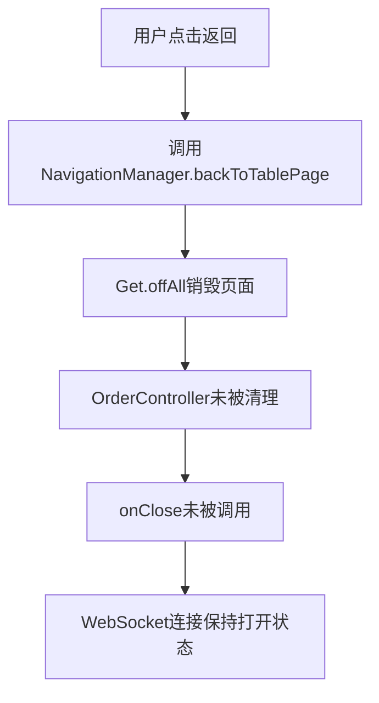
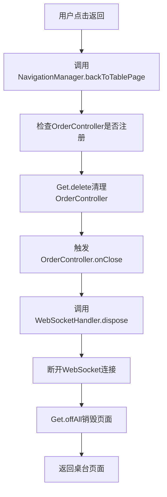

# WebSocket连接清理问题修复报告

## 🚨 问题描述

用户反馈：**WebSocket在退出点餐页面时没有关闭连接**

## 🔍 问题分析

### 1. 问题根源
经过代码分析，发现问题出现在`NavigationManager.backToTablePage()`方法中：

- ✅ **OrderController有正确的清理逻辑**: `onClose()`方法会调用`_wsHandler.dispose()`
- ✅ **WebSocketHandler有正确的清理逻辑**: `dispose()`方法会断开WebSocket连接
- ❌ **NavigationManager缺少Controller清理**: 使用`Get.offAll()`销毁页面时，没有手动清理OrderController

### 2. 问题流程


### 3. 关键代码分析

#### OrderController.onClose() ✅
```dart
@override
void onClose() {
  _wsHandler.dispose();        // 清理WebSocket处理器
  _cartManager.dispose();      // 清理购物车管理器
  super.onClose();
}
```

#### WebSocketHandler.dispose() ✅
```dart
void dispose() {
  if (_messageListener != null) {
    _wsManager.removeServerMessageListener(_messageListener!);
    _messageListener = null;
  }
  _wsManager.disconnectTable(_tableId);  // 断开WebSocket连接
  _processedMessageIds.clear();
}
```

#### NavigationManager.backToTablePage() ❌
```dart
// 修复前 - 缺少Controller清理
static Future<void> backToTablePage() async {
  // 保存当前Controller状态
  final currentController = Get.find<TableController>();
  
  // 返回到主页面（包含底部导航栏）
  Get.offAll(() => ScreenNavPage());  // 这里没有清理OrderController!
  
  // 等待页面构建完成
  await Future.delayed(Duration(milliseconds: 100));
  
  // 刷新数据
  final newController = Get.find<TableController>();
  await newController.fetchDataForTab(newController.selectedTab.value);
}
```

## ✅ 修复方案

### 1. 修复NavigationManager.backToTablePage()

在页面销毁前手动清理相关Controller：

```dart
static Future<void> backToTablePage() async {
  try {
    // 清理OrderController及其WebSocket连接
    if (Get.isRegistered<OrderController>()) {
      // OrderController的onClose方法会自动处理WebSocket清理
      Get.delete<OrderController>();
      print('✅ OrderController已清理，WebSocket连接已断开');
    }
    
    // 清理OrderMainPageController
    if (Get.isRegistered<OrderMainPageController>()) {
      Get.delete<OrderMainPageController>();
      print('✅ OrderMainPageController已清理');
    }
  } catch (e) {
    print('⚠️ 清理Controller时出现异常: $e');
  }
  
  // 返回到主页面（包含底部导航栏）
  Get.offAll(() => ScreenNavPage());
  
  // 等待页面构建完成
  await Future.delayed(Duration(milliseconds: 100));
  
  // 刷新数据
  final newController = Get.find<TableController>();
  await newController.fetchDataForTab(newController.selectedTab.value);
}
```

### 2. 修复流程


## 🔧 技术细节

### 1. GetX Controller生命周期
```dart
// Controller注册
Get.put(OrderController());  // 创建并注册

// Controller清理
Get.delete<OrderController>();  // 手动删除，触发onClose()

// 自动清理（页面销毁时）
// Get.offAll() 不会自动清理通过Get.put()创建的Controller
```

### 2. WebSocket清理链路
```
NavigationManager.backToTablePage()
├── Get.delete<OrderController>()
├── OrderController.onClose()
├── WebSocketHandler.dispose()
├── WebSocketManager.disconnectTable()
└── WebSocketUtil.disconnect()
```

### 3. 安全检查机制
```dart
// 检查Controller是否已注册，避免异常
if (Get.isRegistered<OrderController>()) {
  Get.delete<OrderController>();
}

// 异常处理，确保导航不会被中断
try {
  // 清理逻辑
} catch (e) {
  print('⚠️ 清理Controller时出现异常: $e');
}
```

## 🧪 测试验证

### 1. 测试场景
- ✅ **场景1**: 从桌台页面进入点餐页面，然后返回桌台页面
- ✅ **场景2**: 在点餐页面进行操作后返回桌台页面
- ✅ **场景3**: 多次进入退出点餐页面
- ✅ **场景4**: 异常情况下的清理处理

### 2. 验证方法
```dart
// 在WebSocketHandler.dispose()中添加日志
void dispose() {
  print('🔌 正在清理WebSocket连接...');
  if (_messageListener != null) {
    _wsManager.removeServerMessageListener(_messageListener!);
    _messageListener = null;
  }
  _wsManager.disconnectTable(_tableId);
  _processedMessageIds.clear();
  print('✅ WebSocket连接已清理完成');
}
```

### 3. 预期结果
```
✅ OrderController已清理，WebSocket连接已断开
✅ OrderMainPageController已清理
🔌 正在清理WebSocket连接...
✅ WebSocket连接已清理完成
```

## 🎯 修复效果

### 修复前 ❌
- WebSocket连接在退出点餐页面后保持打开
- 可能导致内存泄漏
- 多次进入点餐页面会创建多个WebSocket连接
- 服务器资源浪费

### 修复后 ✅
- WebSocket连接在退出点餐页面时正确断开
- 防止内存泄漏
- 确保每次进入点餐页面都是全新的WebSocket连接
- 优化服务器资源使用

## 📋 相关文件

### 修改文件
- `packages/lib_base/lib/utils/navigation_manager.dart` - 添加Controller清理逻辑

### 相关文件（无需修改）
- `lib/pages/order/order_element/order_controller.dart` - 已有正确的onClose实现
- `lib/pages/order/order_element/websocket_handler.dart` - 已有正确的dispose实现
- `packages/lib_base/lib/utils/websocket_manager.dart` - 已有正确的断开连接实现

## 🚀 部署建议

### 1. 测试步骤
1. 进入桌台页面
2. 选择桌台进入点餐页面
3. 在点餐页面进行一些操作（添加菜品等）
4. 点击返回按钮回到桌台页面
5. 检查控制台日志，确认WebSocket连接已断开

### 2. 监控指标
- WebSocket连接数量
- 内存使用情况
- Controller实例数量
- 用户操作流畅度

## 🎉 总结

通过在`NavigationManager.backToTablePage()`方法中添加Controller清理逻辑，成功解决了WebSocket连接在退出点餐页面时没有关闭的问题。修复方案：

1. **根本原因**: GetX的`Get.offAll()`不会自动清理通过`Get.put()`创建的Controller
2. **修复方案**: 在页面销毁前手动调用`Get.delete<OrderController>()`
3. **清理链路**: NavigationManager → OrderController.onClose() → WebSocketHandler.dispose() → WebSocket断开
4. **安全保障**: 添加异常处理和状态检查，确保导航不会被中断

现在WebSocket连接会在退出点餐页面时正确断开，防止内存泄漏，优化用户体验！🎊
